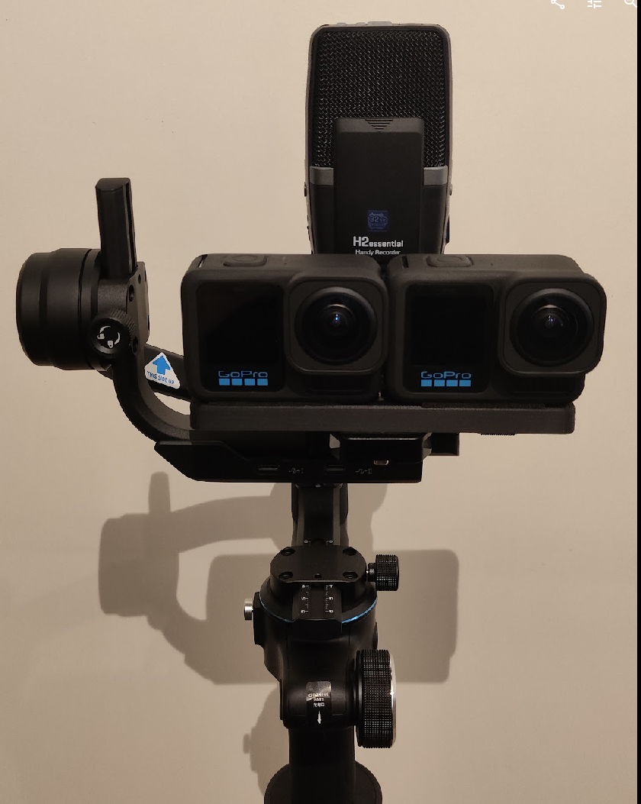

# dugotovr - Dual GoPro Toolkit for 180VR
This is a collection of tools (scripts) and 3d printable parts for VR180 content creation using two GoPro 13s with the Ultrawide Lens Mod.



In comparison to the many other offerings (Canon EOS RF 5.2mm Dual Fisheye, Canon EOS RF-S 3.9mm Dual Fisheye, Calf 2/Visinse, SLAM XCAM, etc...) two GoPro's can be easily had for under 1000$, while offering very high resolution 8K (4K per eye) footage in 10 bit, with the highest bitrate among all the consumer options (i.e. Calf, SLAM, etc...) and a 177 degree FoV.

However, the biggest pain points with two separate cameras is synchronization and a complex post-production workflow, which is hopefully made a little bit easier with this collection of tools.

## Tips for shooting with two GoPros
- Use Timecode Sync regularly to keep both cameras in sync. This can be done in the [official gopro app](https://community.gopro.com/s/article/HERO12-Black-Timecode-Sync), or via the [labs firmware](https://gopro.github.io/labs/) + the [QR Code Generators](https://gopro.github.io/labs/control/custom/).
- To get the full resolution and FoV, you need the Max Lens Mod 2.0 / Ultrawide Lens with the following settings:
  - Lens: Standard (do not enable the max / ultrawide lens mode)
  - Framing: 8:7
  - Resolution: 5.3K
  - Frame Rate: 30
  - Digital Lens: Wide (the only option)
  - HyperSmooth: Off
  - Profile: Standard or Log. HDR doesn't work with 5.3K unfortunately.
  
  -> you should be seeing (almost) the full fisheye in the preview, without it being stretched, cut-off or moving when you move the camera.

## Prerequisites
- NVidia GPU and [CUDA toolkit](https://developer.nvidia.com/cuda-toolkit) installed
- FFmpeg with CUDA support (i.e. ffmpeg-git-full for windows: https://www.gyan.dev/ffmpeg/builds/) or [compiled from source](https://docs.nvidia.com/video-technologies/video-codec-sdk/12.0/ffmpeg-with-nvidia-gpu/index.html)
- Python via Conda (anaconda, miniconda)

Ensure that ffmpeg works with cuda, i.e. make sure this plays one of your gopro clips:
```
ffplay -vcodec hevc_cuvid GX010004.mp4
```
# In a nutshell - from two video files to VR180 video
To convert the raw footage from your GoPros into something you can watch in VR180 with any device, there are a couple of steps that need to happen:
  1. left and right footage clips need to be synchronized to the frame to avoid any ghosting and visual artifacts
  2. the clips need to be put side-by-side
  3. left and right need to be calibrated (i.e. slightly transformed) so that the stereo looks correct
  4. the fisheye footage needs to be remapped into an equirectangular format

On the EOS VR side, this can be done with the EOS VR Utility, however this will cost you 5$ per month for something you can do for free, and only works with Canon Cameras. You also have very little control about the process, and can only adjust basic settings.

Steps 3 and 4 can be done combined and more efficient with an STMap.
To generate such an STMap, you can use the KartaVR Fusion Composition "Dual Fisheye STMap Creation v001".

I recommend to watch the following videos to get a better understanding:
- https://www.youtube.com/watch?v=kwVlVEXg3og
- recent videos from sailing360: https://www.youtube.com/@Sailing360

# Scripts

## sync.py
This script will look through a folder of footage and find matching clips (based on timecode and date/time metadata), trim them so that they are aligned (automatically based on timecode), crop the fisheye into a 1:1 ratio, and combine the clips into a single side-by-side file for further processing. No dewarping / conversion to equirectangular will be done, to allow for more flexibility for calibration and mask (and also because ffmpegs remap is not gpu/cuda accelerated...).

## dewarp.py
Dewarps and aligns the dual fisheye footage (using an STMap?).
Multiple options for implementation: ffmpeg + remap (CPU only), ffmpeg + v360 (CPU only), or gstreamer (either gst-nvdewarper or gst-nvivafilter + cv::cuda::remap)

# The Setup™️
2x GoPro Hero 13, FeiyuTech Scorp-C, SIRUI AM-404FL, Zoom H2essential, Movo SMM5-B Shock Mount, a 3D-printed bracket to hold both GoPros securely

# The Workflow™️

Filming
- sync timecode and match settings (iso, shutter, etc) via QRControl
- start recording on audio recorder
- start recording on both GoPros simultaneously via "The Remote" or an app like [GoPro Remote](https://play.google.com/store/apps/details?id=uk.co.purplelabs.gopro_remote)
- use a clapperboard to make audio and video synchronization much easier

Ingress
- Dump footage from both cameras into a shared folder
- Run the `sync.py` script to organize, match, align, trim and combine

Process (for each clip)
- Generate STMap (in DaVinci Fusion/Resolve) -> or re-use an STMap if you're confident the cameras have not moved
- Apply the STMap (dewarping and converting to equirectangular) using TouchDesigner and the Stitch template


# Notes
- Make sure the GoPros are very secure and aligned. If they get loose during your filming, your footage will be ruined. And if they keep moving, you will have to keep calibrating them.
- Doing the conversion from dual fisheye to equirectangular is expensive, and if you don't have the beefiest PC, doing it in Resolve with KartaVRs kvrCreateStereo, kvrCropStereo, kvrViewer, etc... is painfully slow. STMaps will 
- The Ultrawide / Max Lens is waterpoof up to 5m, but won't actually work well underwater due to pesky limitations on how light works underwater. If you want a sharp picture, you need a dome with a decent spacing to the lens.