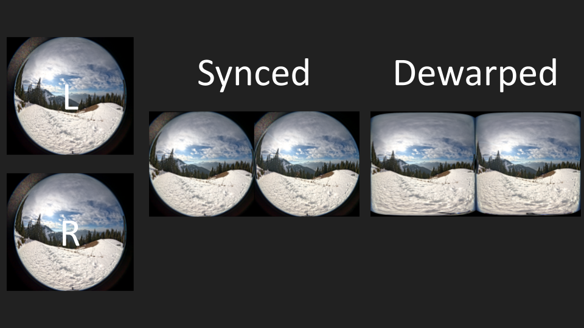
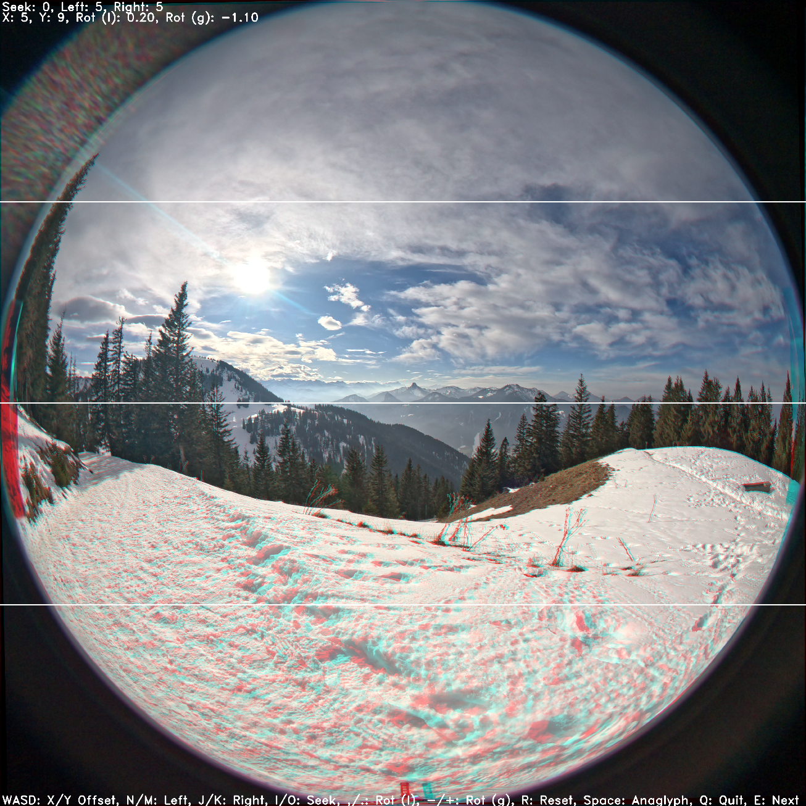

# dugotovr - Dual GoPro Toolkit for 180VR
This is a collection of tools (scripts) and 3d printable parts for VR180 content creation using two GoPro 13s with the Ultrawide Lens Mod.


In comparison to the many other offerings (Canon EOS RF 5.2mm Dual Fisheye, Canon EOS RF-S 3.9mm Dual Fisheye, Calf 2/Visinse, SLAM XCAM, etc...) two GoPro's can be easily had for under 1000$, while offering very high resolution 8K (4K per eye) footage in 10 bit, with the highest bitrate among all the consumer options (i.e. Calf, SLAM, etc...) and a 177 degree FoV.

However, the biggest pain points with two separate cameras is synchronization and a complex post-production workflow, which is hopefully made a little bit easier with this collection of tools.

## Tips for shooting with two GoPros
- Use Timecode Sync **before each recording** to keep both cameras in sync. This can be done in the [official gopro app](https://community.gopro.com/s/article/HERO12-Black-Timecode-Sync), or via the [labs firmware](https://gopro.github.io/labs/) + the [QR Code Generators](https://gopro.github.io/labs/control/custom/).
- To get the full resolution and FoV, you need the Max Lens Mod 2.0 / Ultrawide Lens with the following settings:
  - Lens: Standard (do not enable the max / ultrawide lens mode)
  - Framing: 8:7
  - Resolution: 5.3K
  - Frame Rate: 30
  - Digital Lens: Wide (the only option)
  - HyperSmooth: Off
  - Profile: Standard or Log. HDR doesn't work with 5.3K unfortunately.
  
  -> you should be seeing (almost) the full fisheye in the preview, without it being stretched, cut-off or moving when you move the camera.

## Prerequisites
- NVidia GPU and [CUDA toolkit](https://developer.nvidia.com/cuda-toolkit) if you want GPU-accelerated hevc en-/decode.
- FFmpeg with CUDA support (i.e. `choco install ffmpeg-full` on windows) or [compiled from source](https://docs.nvidia.com/video-technologies/video-codec-sdk/12.0/ffmpeg-with-nvidia-gpu/index.html)
- Python

Ensure that ffmpeg works with cuda, i.e. make sure this plays one of your gopro clips:
```
ffplay -vcodec hevc_cuvid GX010004.mp4
```
# In a nutshell - from two video files to VR180 video



To convert the raw footage from your GoPros into something you can watch in VR180 with any device, there are a couple of steps that need to happen:
  1. left and right footage clips need to be synchronized to the frame to avoid any ghosting and visual artifacts
  2. the clips need to be put side-by-side
  3. left and right need to be stereo calibrated (i.e. slightly transformed in x/y and rotation) so that the stereo looks correct
  4. the fisheye footage needs to be remapped into an equirectangular format

# Scripts

## sync.py
```
usage: sync.py [-h] [-o] [-d] [-m MASK] [-p] [--cuda] [--no-cuda] ingress egress

positional arguments:
  ingress               the path to ingress from
  egress                the path to egress to

options:
  -h, --help            show this help message and exit
  -o, --organize        create a folder structure of year-mm-dd/ at the egress
  -d, --dewarp          dewarp the fisheye video to VR180
  -m MASK, --mask MASK  apply a mask to the dewarped video
  -p, --preview         generate only a preview (15s)
  --cuda                use CUDA accelerated operations
  --no-cuda             don't use CUDA
```

This script will look through a folder of footage and find matching clips (based on timecode and date/time metadata), trim/sync them so that they are aligned (automatically based on timecode or via manually adjusted calibration), crop the fisheye into a 1:1 ratio, and combine the clips into a single side-by-side file for further processing.
This can also perform fisheye to equirectangular conversion (--dewarp), and stereo calibration if it has been done beforehand with `calibrate.py`.
Footage can look "fine" without stereo calibration, but doing it is highly recommended for the best viewing experience.
Finally, a mask can also be applied (see templates in mask folder) to create a clean edge and to optionally remove a bit of FoV to hide the left/right lens only visible in each eye.

**NOTE**: for the script to have any idea which one is the left and which one is the right camera, you will need to have subfolders denoting which clips are left, and which are right.

Examples:

Run with CUDA, dewarp and organize:
```
 python .\scripts\sync.py --dewarp --cuda --organize .\video\ingress\test .\video\synced
```

Example: Run with CUDA, dewarp, organize and apply a mask to hide the lenses
```
 python .\scripts\sync.py --dewarp --cuda --organize --mask .\mask\hidden_lens_transparent.png .\video\ingress\test .\video\synced
```

Example: Run with CUDA, dewarp, organize and apply a mask, but only generate a preview of 15s per clip
```
 python .\scripts\sync.py --preview --dewarp --cuda --organize --mask .\mask\hidden_lens_transparent.png .\video\ingress\test .\video\synced
```

## calibrate.py
```
usage: calibrate.py [-h] [-s] ingress

positional arguments:
  ingress     the path to ingress from

options:
  -h, --help  show this help message and exit
  -s, --skip  skip already calibrated files
```

This script allows to interactively synchronize clips on a frame-by-frame basis (if the timecode has drifted), and to perform stereo calibration for x/y offset and global/local rotation. The calibration will be stored in a yaml file next to the mp4, and used by sync.py automatically if it is present.

Example: 
```
python .\scripts\calibrate.py path\to\footage
```




# The Setup™️
2x GoPro Hero 13, FeiyuTech Scorp-C, SIRUI AM-404FL, Zoom H2essential, Movo SMM5-B Shock Mount, a 3D-printed bracket to hold both GoPros securely

# The Workflow™️

Filming (for each recording)
- make sure to match settings (iso, shutter, white balance, etc...)
- **sync timecode via QRControl** -> If you didn't, you can manually adjust with the calibrate script, but it will be annoying.
- start recording on audio recorder
- start recording on both GoPros simultaneously via "The Remote" or an app like [GoPro Remote](https://play.google.com/store/apps/details?id=uk.co.purplelabs.gopro_remote)
- use a clapperboard to make audio and video synchronization much easier

Ingress
- Dump footage from both cameras into a folder and adjust the path to contain "left" and "right", i.e. by putting them into left and right subfolders, or including "left" or "right" in the filename.
- Run the `calibrate.py` script for timecode alignment and stereo calibration (can be skipped)
- Run the `sync.py` script to automatically organize, match, crop, trim, align based on timecode and merge into a single sbs video per pair.


## Benchmarks
Performed on a Ryzen 3700X, 32GB RAM, RTX 2080 Super.

### sync.py
- with cuda, without dewarp, with stereo correction -> 26 FPS
- with cuda, with dewarp, with stereo correction -> 9 FPS
- without cuda, with dewarp, with stereo correction -> 1.6 FPS

# Notes
- Make sure the GoPros are very secure and aligned, if they keep moving, you'll have to redo the calibration for every clip.
- The Ultrawide / Max Lens is waterpoof up to 5m, but won't actually work well underwater due to pesky limitations on how light works underwater. If you want a sharp picture, you need a dome with a decent spacing to the lens.
- I originally used Davinci Resolve and the Kartaverse plugins, but this solution is completely free, cross-platform and much faster than DaVinci Resolve.